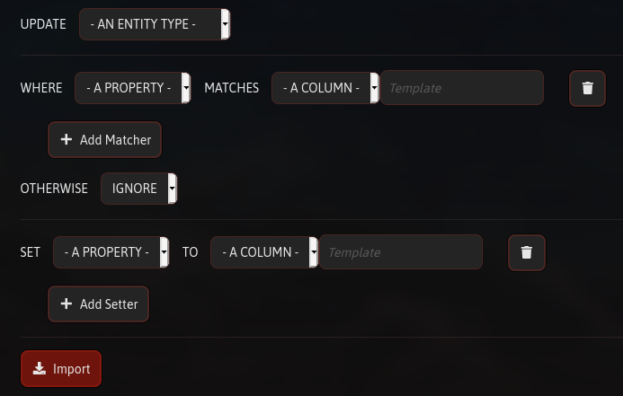

# Importing Data

When you have a lot of data to input at once, it might be easier to organise it in a spreadsheet or use a script. In those cases, you can import the resulting CSV or JSON directly into FrontierNav.


Importing Data is NOT the same as [Opening Changes](making-changes.md#opening-changes).


Before trying to import anything, make sure you've created all the entity types and properties that you plan to import to.

Choose a file and you'll be presented with a form.



First select the Entity Type to import into. After that, select the criteria to **match** an Entity to a row in your file. Finally, **set** the matched Entity's properties to columns in that row.

If a row doesn't match any entity, by default it will be ignored. You can choose to **create** an Entity instead. However, if doing so, you need to **set** a unique Name property. The import will fail if there is no Name.

You can do the same when **setting** Relationships, where you don't need a Name, but a target Entity must **match**. If you want to **create** the target Entity too, you must **match** a unique Name otherwise it will be ignored.


## Supported File Formats

### CSV

CSVs are a file format that most spreadsheet software can export to so check your "Save As..." or "Export" options and choose "CSV". You MUST have column headings.

```text
Name,Price
Potion,20
Sword,500
```

### JSON

If you're using scripts, you can export to an array of JSON objects.

```text
[
  {
    "name": "Potion",
    "price": 20 
  },
  {
    "name": "Sword",
    "price": 500
  }
]
```


