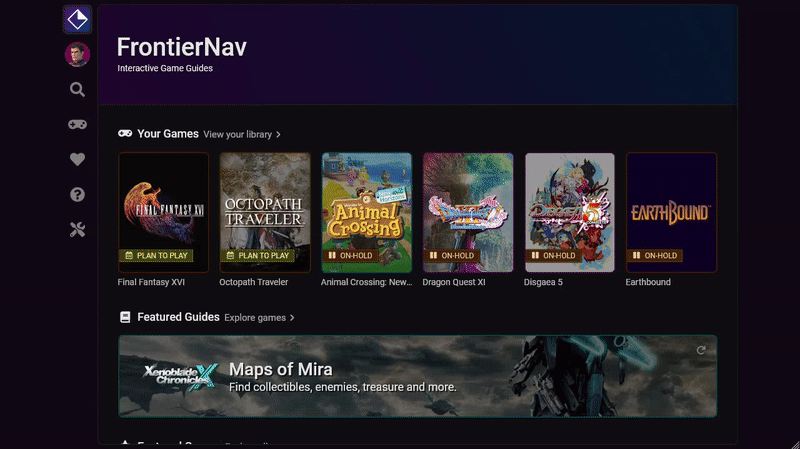

# Navigation Bar

The strip of icons along the left side of every page is called the Navigation Bar. It allows you to access common pages where ever you are on the website.

The Navigation Bar is contextual. When you're within a game context, it'll show navigation for that game. If you haven't chosen a game, it'll show global navigation.

