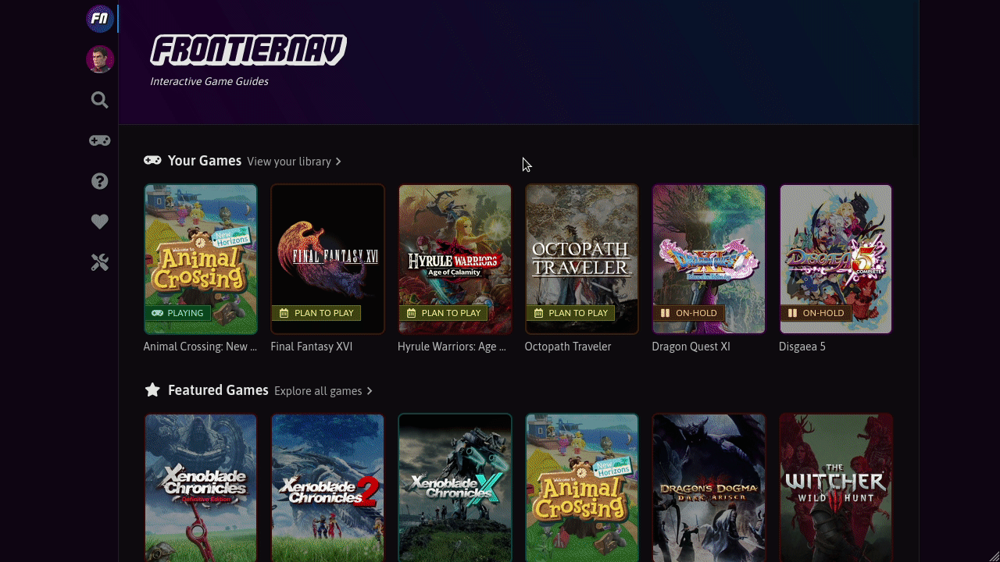

# Universal Search

Use Universal Search to find Entities and Entity Types quickly.

**CTRL + P** opens the search dialog instantly from anywhere.

**Tab**, **SHIFT + Tab** and **Enter** lets you navigate and select results.

**ESC** closes the search dialog.

