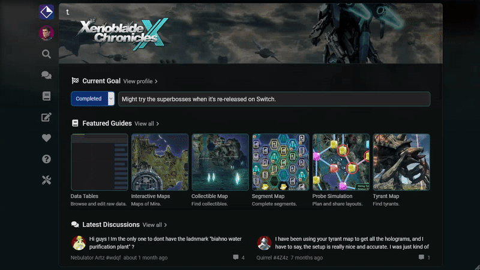

# User Drawer

Clicking on your Avatar in the [Navigation Bar](navigation-bar.md) will open up the User Drawer. This lets you access various pages specific to you such as your Profile, Settings and if you've chosen a game, [Game Preferences](game-preferences.md). Like with the Navigation Bar, it is also contextual and changes based on whether you have chosen a game or not.

